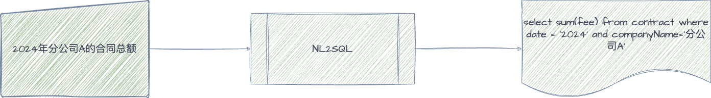
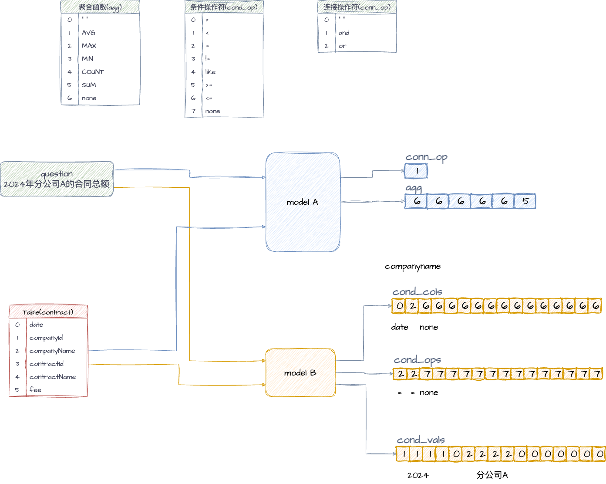
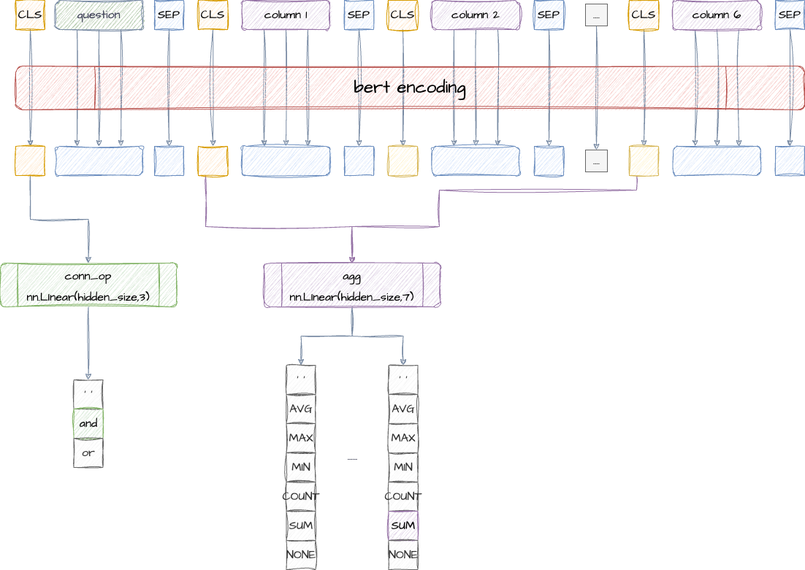
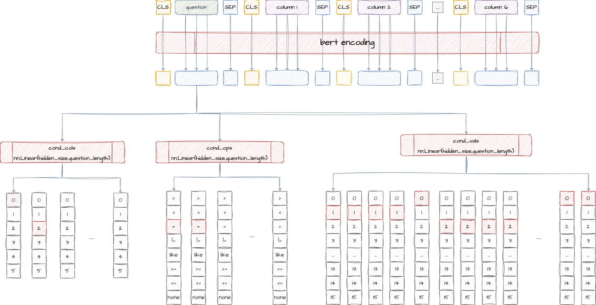

# 自然语言转结构化SQL

将自然语言转为机器可以理解的SQL语言，旨在拉近用户与结构化数据间的距离，实现人机交互体验升级。实现基本思路：

1. 定义结构化`sql` 
2. `label`训练数据
3. 采用`bert`预训练模型
4. 下游模型构建
5. `pytorch`编程
6. 模型训练
7. 模型预测


## 定义结构化`sql`

首先，明确算法输入为自然语言，算法输出为结构化`sql`。大体如下图所示：




从上图可知，需要明确输出，因此需要定义标准结构的`sql`。`sql`关键信息包含**表名(table_name)**、**查询列(sel_col)**、**聚合操作(agg)**、**条件（cond)**，其中条件又包含**条件列(cond_col)**、**条件操作符(cond_op)**、**条件值(cond_value)**以及**连接操作符(conn_op)**。本方案`sql`定义如下：


如果采用json格式输出，则输出结果如下：


上图，观察`"agg":[5]`会发现该结构存在问题，`agg`聚会操作应该需要能够表示出两部分信息，分别为**聚会函数（AVG、MIN等）和聚合列**。但是`"agg":[5]`只能表示出聚合函数，并无法表示出聚合列。同时观察`"sel_col":["fee"]`、`"conds": [["date", 2, "2024"],["companyName", 2, "分公司A"]]`出现了列名`fee`、`date`、`companyName`不利于算法训练。**因此为解决上述问题，需要对表中所有的列进行编码，以便利用编码后的索引**，本方案采用简单的编码方式如下图所示：


已对表中的所有列进行编码，若要使用其列编号，则`agg`需要**显示所有列的聚合函数**。**条件操作符(cond_op)**和**条件值(cond_value)**

亦是如此。按照上述方式，最终输出结果如下所示：


上图可见，**查询列(sel_col)**和**条件列(cond_col)**已去除，因为在`"agg": [6, 6, 6, 6, 6, 5]`中已能表示出需要**查询列**，以及在`"cond_ops": [2, 7, 2, 7, 7, 7],"cond_vals": ["2024", null, "分公司A", null, null, null]`中能表示出**条件列**。

从最终的输出可以看出，本方法对NL2SQL问题的处理方案采用的是解决**多分类问题**。

## `label`训练数据

在已经确定算法输入输出的前提下，可以进行标签数据收集。**标签数据是指在监督学习中用于训练和评估模型的一组已知输出**。在监督学习任务中，我们训练模型来学习输入数据和相应输出标签之间的映射关系。这个映射关系用于模型对新的、之前未见过的输入数据进行预测。

由[结构化`SQL`](##定义结构化`sql`)可知需要收集的标签数据有两部分：（1）表及其所有需训练的列 （2）问题及对应的结构化`SQL`

- 表及其所有需训练的列
  需要收集希望被训练及预测的表及其列，并对列进行编码。如下所示：

  

  

- 问题及对应的结构化`SQL`
  若使用`json`格式的训练数据，最终效果如下：

  ```json
  {
  "question": "2024年分公司A的合同总额",
  "table_id": "contract",
  "sql": {
  "sel_col": ["fee"],
  "agg": [[5,"fee"]],
  "limit": 0,
  "orderby": [],
  "asc_desc": 0,
  "conn_op": 1,
  "conds": [
  ["date", 2, "2024"],
  ["companyName", 2, "分公司A"]
  ]
  },
  "keywords": {
  "sel_cols": ["总额"],
  "values": ["2024", "分公司A"]
  }
  }
  ```

  由[结构化`SQL`](##定义结构化`sql`)可知，上述训练数据还不能直接用于训练，需要进行编码转换，最终：

  ```json
  {
  "question": "2024年分公司A的合同总额",
  "table_id": "contract",
  "sql": {
  "agg": [6, 6, 6, 6, 6, 5],
  "limit": 0,
  "orderby": [],
  "asc_desc": 0,
  "conn_op": 1,
  "cond_ops": [2, 7, 2, 7, 7, 7],
  "cond_vals": ["2024", null, "分公司A", null, null, null]
  },
  "keywords": {
  "sel_cols": ["总额"],
  "values": ["2024", "分公司A"]
  }
  }
  ```


## 采用`bert`预训练模型

解决自然语言转结构化`SQL`问题涉及到自然语言识别(`NLP`)，同时考虑到`label`数据数据量小的问题，采用已经预训练好的模型`bert`作为本算法的上游模型，然后本算法模型在`bert`模型的基础上搭建下游模型，该下游模型主要处理的问题是[结构化`SQL`](##定义结构化`sql`)中所分析出来的**多分类问题

[bert模型使用](BERT-README.md)

## 下游模型构建

由[结构化`SQL`](##定义结构化`sql`)可知，下游模型需要处理的是**多分类问题**，主要需要训练的内容是**`agg`聚合操作、`conn_op`连接符、`cond_op`条件操作符、`cond_vals`条件操作值**。主要存在的问题是**查询列、条件数量是不固定的**，由于已经对列进行的确定的编码，因此**查询列、条件数量的最大值是确定的**。因此**`agg`、`cond_op`、`cond_vals`会对所有列进行分类训练**。

从上述思路中，还存在可优化的点是**`cond_op`与`cond_vals`之间存在必然的数量关系**。即假设某个`question`训练出来的`cond_op`的数量是2，那么`cond_vals`的数量必然也是2。为了优化该问题，将模型拆分成两部分，第一部分训练&预测`agg`和`cond_op`，第二部分训练&预测`cond_vals`，**预测时接受第一部分模型预测出来的cond_op的数量**。整体结构如下图所示：




### model A

模型A负责训练`agg`、`conn_op`和`cond_ops`。因为采用`bert`作为上游训练模型，`bert`的输入要求一个`tokenization`。需要将`question`和`table column`按顺序拼接成一个`tokenization`作为`bert`模型的输入。


模型A的架构如下：



### model B

模型B负责训练`cond_vals`，架构如下：




## `pytorch`编程

`pytorch`框架已对`bert`模型做了很好的封装。本方案采用`pytorch`进行算法编程。

## 模型训练


## 模型预测